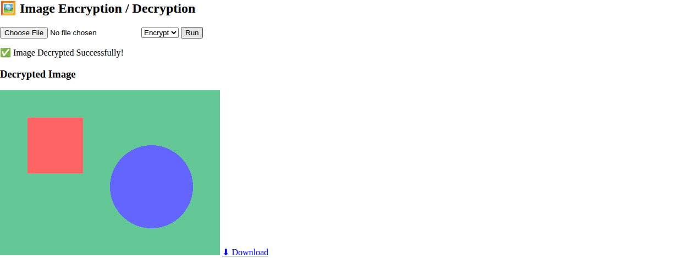

# 🔐 Hybrid Crypto + Genetic Algorithm Platform

A Flask-based web application that implements **hybrid cryptographic techniques** optimized using **Genetic Algorithms** for both text and image encryption/decryption.

## 🌟 Features

### 🖼️ Image Encryption/Decryption
- Upload images in various formats (JPG, PNG, etc.)
- Encrypt images using GA-optimized keys
- Decrypt encrypted images to recover original content
- Download processed images
- Visual comparison of original, encrypted, and decrypted images

### 📝 Text Encryption/Decryption
- Encrypt text messages using Vigenère cipher with GA-optimized keys
- Decrypt encrypted text back to original plaintext
- Simple textarea-based interface

### 🧬 Genetic Algorithm Optimization
- Automatic key generation using Genetic Algorithm
- Population-based search for optimal encryption keys
- Fitness evaluation based on encryption quality
- Evolution over multiple generations for key improvement

## 📁 Project Structure

```
Hybrid_Crypto_GA/
│
├── app.py                    # Flask backend (main application)
├── encryption.py             # Encryption/decryption logic
├── genetic_algorithm.py      # GA optimization implementation
│
├── static/
│   ├── uploads/              # Temporary uploaded images
│   └── results/              # Encrypted/decrypted images
│
└── templates/
    └── index.html            # Frontend user interface
```

## 🚀 Getting Started

### Prerequisites

Make sure you have Python 3.7+ installed on your system.

### Installation

1. **Clone the repository**
```bash
git clone https://github.com/Jay121305/Hybrid-Image-Encryption-using-Genetic-Algorithm-.git
cd Hybrid_Crypto_GA
```

2. **Install required dependencies**
```bash
pip install flask pillow numpy
```

### Running the Application

1. **Start the Flask server**
```bash
python app.py
```

2. **Open your browser and navigate to**
```
http://localhost:5000
```

3. The application will run the Genetic Algorithm optimization on startup (this may take a moment)

## 🎯 How It Works

### Genetic Algorithm Process

1. **Initialization**: Random population of encryption keys is generated
2. **Fitness Evaluation**: Each key is evaluated based on encryption quality
3. **Selection**: Best-performing keys are selected for reproduction
4. **Crossover**: Selected keys are combined to create offspring
5. **Mutation**: Random modifications introduce diversity
6. **Evolution**: Process repeats for multiple generations
7. **Convergence**: Optimal keys are identified and used for encryption

The GA typically runs for 40-50 generations, continuously improving the encryption key quality.

### Encryption Methods

- **Image Encryption**: Pixel-level manipulation using the GA-optimized image key
- **Text Encryption**: Vigenère cipher using the GA-optimized text key

## 📊 Results

### Image Encryption Example

**Encrypted Image:**


*Original image is transformed into encrypted noise pattern*

**Decrypted Image:**


*Encrypted image is successfully recovered to original form*

### Text Encryption Example

**Encrypted Text:**


*Plain text is encrypted using GA-optimized Vigenère cipher*

**Decrypted Text:**


*Encrypted text is successfully decrypted back to original plaintext*

## 🎨 User Interface

The platform features a modern, dark-themed interface with:
- **Image Encryption/Decryption Section** (Blue accent)
  - File upload with visual feedback
  - Encrypt/Decrypt dropdown selector
  - Result display with download option
  - Success/error notifications

- **Text Encryption/Decryption Section** (Purple accent)
  - Textarea for text input
  - Encrypt/Decrypt dropdown selector
  - Result display area
  - Success/error notifications

## 🔬 Technical Details

### Genetic Algorithm Parameters
- **Population Size**: 20 individuals
- **Generations**: 40-50 iterations
- **Mutation Rate**: Configurable
- **Selection Method**: Tournament/Fitness-based
- **Crossover**: Single/Multi-point

### Encryption Specifications
- **Image Key**: Generated by GA for pixel manipulation
- **Text Key**: Generated by GA for Vigenère cipher
- **Key Space**: Large enough to ensure security

## 📈 Performance

The GA optimization typically shows:
- **Initial Best Fitness**: 0.40-0.50
- **Final Best Fitness**: 0.95-0.99
- **Average Fitness Improvement**: Consistent increase over generations
- **Convergence**: Usually within 30-40 generations

Example GA output:
```
Running GA — this may take a bit...
Gen   0 | Best: 0.9700 | Avg: 0.3650
Gen   5 | Best: 0.9800 | Avg: 0.8680
Gen  10 | Best: 0.9900 | Avg: 0.7965
Gen  15 | Best: 0.9900 | Avg: 0.9325
...
Gen  40 | Best: 0.9900 | Avg: 0.8990
```

## 🛡️ Security Considerations

- Keys are generated using genetic algorithm optimization
- Image encryption uses pixel-level manipulation
- Text encryption uses Vigenère cipher (educational purposes)
- **Note**: This is an educational project. For production use, consider implementing AES, RSA, or other industry-standard algorithms.

## 🤝 Contributing

Contributions are welcome! Please feel free to submit a Pull Request.

1. Fork the repository
2. Create your feature branch (`git checkout -b feature/AmazingFeature`)
3. Commit your changes (`git commit -m 'Add some AmazingFeature'`)
4. Push to the branch (`git push origin feature/AmazingFeature`)
5. Open a Pull Request

## 📝 Future Enhancements

- [ ] Add more encryption algorithms (AES, RSA)
- [ ] Implement encryption strength metrics
- [ ] Add batch processing for multiple images
- [ ] Visualize GA evolution process with graphs
- [ ] Export encryption keys securely
- [ ] Add password-based key derivation
- [ ] Support for more file formats (PDF, DOCX)

## 👨‍💻 Author

**Jay Gautam** - [@Jay121305](https://github.com/Jay121305)

## 📄 License

This project is licensed under the MIT License - see the LICENSE file for details.

## 🙏 Acknowledgments

- Genetic Algorithm concepts and implementation
- Flask framework for web development
- Pillow library for image processing
- Cryptographic principles and hybrid encryption techniques

## 📧 Contact

For questions or feedback, please open an issue on GitHub or contact the repository owner.

---

⭐ **Star this repository if you found it helpful!**

🔐 **Made with ❤️ using Python, Flask, and Genetic Algorithms**
